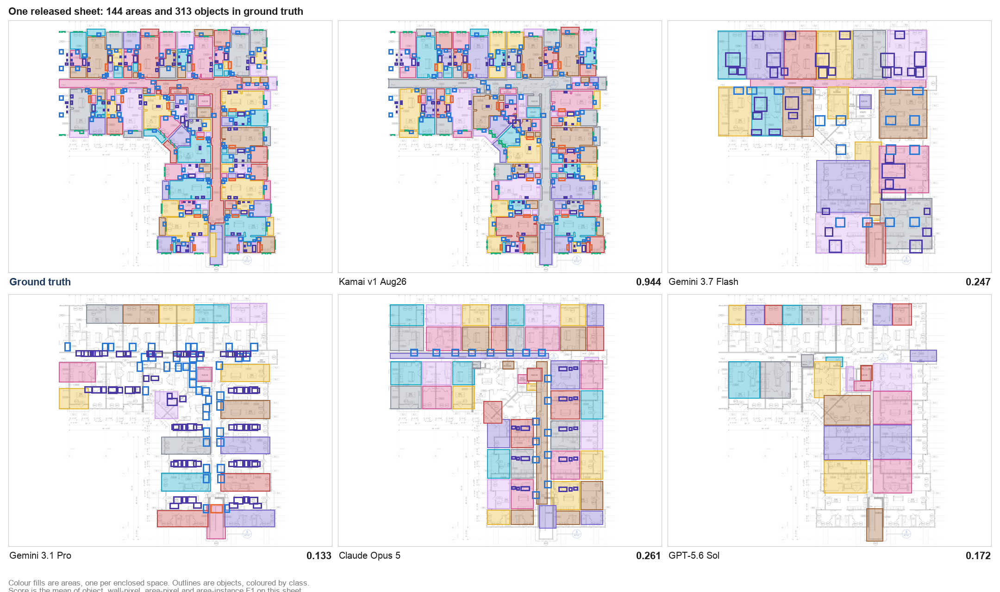
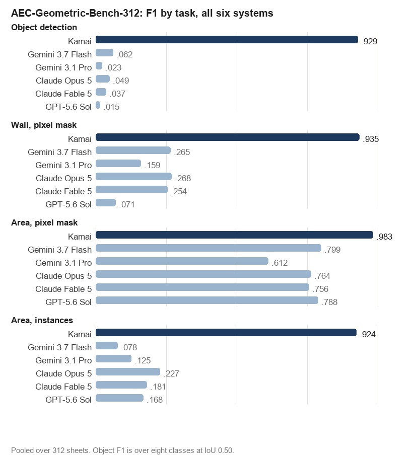

# AEC-Geometric-Bench

Geometric and symbolic data extraction from construction drawings: a benchmark for
reading what is on an architectural sheet, the doors, windows and fixtures a quantity
takeoff prices, and the walls and enclosed areas it measures.

The corpus split is **AEC-Geometric-Bench-312** (everything scored) and
**AEC-Geometric-Bench-15** (the sheets released here).



Ground truth first, then five of the six systems on the identical crop of one released
sheet. Kamai reproduces the annotation closely; the models recover parts of the floor
area but few of the objects, and rarely resolve the area into the right rooms.

Six systems are scored under one uniform condition: one PDF is submitted, one
response is returned, and everything the system reports is scored. The corpus is
312 single-page architectural sheets issued for construction, carrying
24,771 annotated object instances, 59,328 wall shapes and
16,112 area shapes. **Fifteen of those sheets are released here with their
ground truth**, so the result can be recomputed rather than taken on trust.

## Results on AEC-Geometric-Bench-312



| system | P | R | **F1** | wall px | area px | area inst |
|---|---|---|---|---|---|---|
| Kamai | 0.932 | 0.927 | **0.929** | 0.935 | 0.983 | 0.924 |
| Gemini 3.7 Flash | 0.122 | 0.042 | **0.062** | 0.265 | 0.799 | 0.078 |
| Gemini 3.1 Pro | 0.037 | 0.017 | **0.023** | 0.159 | 0.612 | 0.125 |
| Claude Opus 5 | 0.126 | 0.030 | **0.049** | 0.268 | 0.764 | 0.227 |
| Claude Fable 5 | 0.152 | 0.021 | **0.037** | 0.254 | 0.756 | 0.181 |
| GPT-5.6 Sol | 0.037 | 0.010 | **0.015** | 0.071 | 0.788 | 0.168 |

Object F1 is over eight classes at IoU 0.50, pooled across sheets. On identical
ground truth Kamai reaches 0.929 while the strongest model,
Gemini 3.7 Flash, reaches 0.062.

Segmentation is far more favourable to the models: they recover
0.612 to
0.799 area pixel F1 against
Kamai's 0.983. But area *instance* F1 collapses to
0.078 to
0.227: they find the floor area
without resolving it into discrete rooms, which is what a takeoff needs.

## Results on AEC-Geometric-Bench-15, the fifteen released sheets

| system | P | R | **F1** | wall px | area px | area inst |
|---|---|---|---|---|---|---|
| Kamai | 0.940 | 0.919 | **0.929** | 0.931 | 0.987 | 0.941 |
| Gemini 3.7 Flash | 0.074 | 0.020 | **0.031** | 0.238 | 0.797 | 0.077 |
| Gemini 3.1 Pro | 0.025 | 0.010 | **0.015** | 0.182 | 0.548 | 0.116 |
| Claude Opus 5 | 0.061 | 0.015 | **0.024** | 0.278 | 0.782 | 0.227 |
| Claude Fable 5 | 0.066 | 0.007 | **0.013** | 0.287 | 0.780 | 0.186 |
| GPT-5.6 Sol | 0.007 | 0.002 | **0.003** | 0.089 | 0.741 | 0.096 |

These fifteen sit essentially at the corpus average for Kamai
(0.929 against 0.930).

## Layout

```
paper/paper.pdf                  the paper
dataset/                         the fifteen released sheets, see dataset/README.md
  pdf/sheet_01.pdf .. sheet_15.pdf   redacted source drawings
  annotations_15.xml                 CVAT 1.1 export, as annotated
  annotations_15_scoring_ready.xml   the same with the scoring rules applied
  taxonomy.json                      the frozen class map and its SHA-256
  per_sheet_scores.json              every system, every sheet
  manifest.json                      dimensions, shape counts, SHA-256
scoring/score.py                 scores a folder of predictions
scoring/example-predictions/     Kamai's own output, as a worked example
```

## Reproducing the numbers

```bash
cd scoring
python3 score.py --pred example-predictions/kamai --name "Kamai v1 Aug26"
```

prints

```
OBJECT MICRO           1500     96    132   0.940   0.919   0.929
wall pixel                                  0.954   0.908   0.931
area pixel                                  0.990   0.985   0.987
area instance                               0.961   0.921   0.940
```

which reproduces the released-subset row above exactly for objects, wall pixel and
area pixel. Area instance reads 0.941 in the paper and 0.940 here: the
paper's harness computes that one IoU on rasterised instance maps, this script computes
it analytically on the merged polygons, and the two differ in the third decimal. Every
other figure is identical.

Requires `numpy`, `shapely` and `Pillow`.

## Scoring rules

Applied identically to every system. `dataset/taxonomy.json` is the frozen class map,
SHA-256 `e4bdca9f28224b33...` (hash the file with the `sha256` and `sha256_recipe`
fields removed, `sort_keys=True`, separators `(",", ":")`).

* **Objects**, eight classes, matched one-to-one at IoU 0.50, highest IoU first, no
  confidence threshold. Both sides are reduced to the axis-aligned envelope: all
  ground-truth boxes carry zero rotation, so scoring an oriented prediction against the
  true polygon would penalise it for being more precise than the annotation.
* **Window** is one class. The annotation source distinguished subtypes, but not
  consistently, so they are merged here and in scoring.
* **Area** is Room, Shaft, Balcony, Elevator and Stairs on **both** sides, with touching
  instances merged into one polygon per enclosed space. Annotators routinely drew one
  space as several adjoining boxes, so without the merge the metric measures drawing
  style. A predicted `Balcony` counts as area exactly as an annotated one does.
* **Wall** is Wall and Railing, scored as a pixel mask only. Ground-truth wall runs are
  tiled into many adjacent boxes, so instance matching over them would measure
  annotation granularity rather than performance.
* The whole page is scored. No region is masked out.
* Object F1 is **pooled** across sheets, not averaged per sheet.

## Prediction format

One JSON per sheet, named for the sheet:

```json
{"sheet": "sheet_01",
  "objects": [{"class": "Single Swing Door", "bbox": [x0, y0, x1, y1]}],
  "areas":   [[[x, y], [x, y], "..."]],
  "walls":   [[[x, y], [x, y], "..."]]}
```

Coordinates are pixels in the frame given by `width` and `height` for that sheet in
`manifest.json`. A class outside the taxonomy is counted as a false positive: a system
that invents a class should not score for it. A missing file is scored as if the system
returned nothing.

## Licence

* **Data** (`dataset/`): CC BY-NC 4.0. Share and adapt for non-commercial purposes with
  attribution to Kamai; commercial use by separate permission. This is the same licence
  CubiCasa5K and FloorPlanCAD carry. See `dataset/LICENSE-DATA.md`.
* **Code** (`scoring/`): Apache 2.0 (`LICENSE-CODE`). The data licence does not attach to
  the evaluation software, so a commercial system can be scored against this benchmark.

The drawings are real construction documents and have been redacted; what was removed,
and the residual risk, is documented in `dataset/LICENSE-DATA.md`.

## Limitations

* Ground truth is single-annotator.
* Fifteen sheets is a small sample; per-class cells in the subset table rest on few
  instances. The corpus figures are the ones to cite.
* Two of the six systems ran through an agent harness that records neither token counts
  nor latency, so no cost figure is given for them.
* This benchmark was produced by the vendor of one of the systems evaluated. The
  protocol was fixed before measuring, the taxonomy was hashed, every system is scored
  on identical ground truth by the same matcher with no per-system exceptions, and the
  ground truth was annotated by a professional team rather than by the authors.
